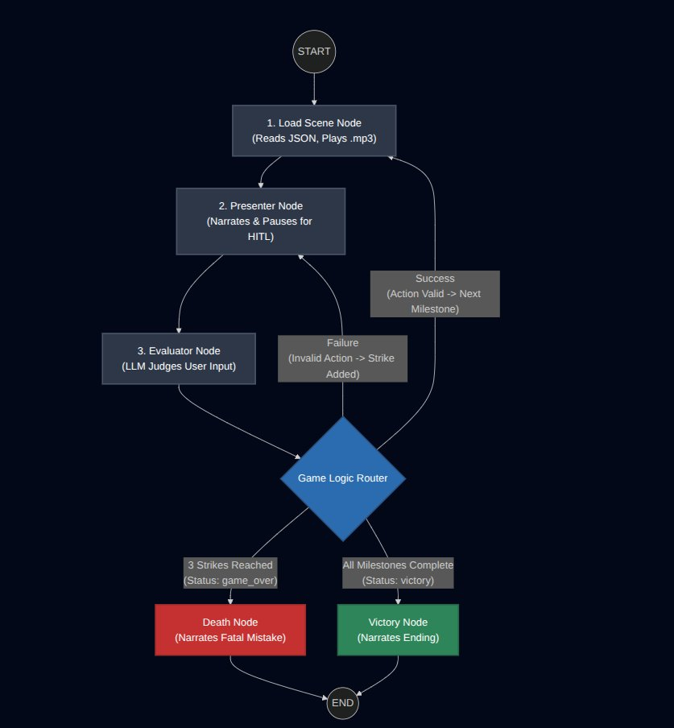

# 🎮 ESCAPE — An Agent-Driven CLI Adventure Game

> *A genre-adaptive, AI-powered text adventure where the story, milestones, and background soundtrack are all generated and orchestrated by LLM agents — in real time.*

---

## 🧠 What is ESCAPE?

ESCAPE is not a pre-written game. It is a **living narrative engine**.

You pick a genre. The agents take over — crafting your storyline, building each milestone on the fly, and selecting ambient background audio to match the scene. Every run is unique. Every choice you make is fed back into the agent graph, which decides what happens next.

Under the hood, ESCAPE is a production-grade demonstration of:
- **LangGraph** stateful multi-agent orchestration
- **Human-in-the-Loop (HITL)** execution pausing
- **Multithreading + Async** for concurrent agent pipelines and real-time audio
- **LLM-driven dynamic content generation** — no hardcoded story

---
<https://www.youtube.com/watch?v=vREN9k8WfZc&t=14s>

## 🏗️ Architecture Overview

<p align="center">
  
</p>

> **How to read this:** The graph starts by loading the first scene (JSON milestone + `.mp3` audio). The **Presenter Node** narrates and triggers a HITL pause for player input. The **Evaluator Node** judges the response — valid actions advance to the next milestone, invalid ones add a strike. The **Game Logic Router** decides the outcome: 3 strikes → Death Node (game over), all milestones cleared → Victory Node (narrative ending).

### Agent Roles

| Agent | Model | Responsibility |
|---|---|---|
| `script_writer_agent` | Qwen3-32B | Generates the full game storyline and displays the intro |
| `milestone_writer_agent` | Qwen3-32B | Creates exactly one milestone per turn (goal, task, audio cue) |
| `analyzer_llm` | Qwen3-32B | Referee — evaluates player responses, handles deviation logic |

---

## ✨ Key Features

### 🎭 Dynamic Storytelling
Choose any genre (horror, sci-fi, fantasy, noir...) and the `script_writer_agent` builds an original narrative. No two games are the same.

### 🏁 Milestone System
Each game milestone is a **structured dict** written to disk containing:
- `goal` — the scene's underlying objective
- `task` — 2-3 sentence scene description in 2nd person, with player choices
- `sound_desc` — 1–3 word audio search query used to fetch real sound effects
- `id` — UUID for audio file mapping

### 🔊 Real-Time Background Audio
Sound effects are fetched live from the [Freesound API](https://freesound.org/) based on the scene context and played in the background via `mpg123` — all without blocking the game loop. Audio runs in a **separate thread** concurrently with agent execution.

### ⏸️ Human-in-the-Loop (HITL)
The LangGraph graph **pauses execution** at every milestone using `interrupt()`. It surfaces the scene narrative to the player, captures their move as structured input, and resumes — feeding the response back into the agent graph as the next context.

### 🧵 Concurrency Model
- `threading.Thread` handles sound downloads and playback without blocking the main async loop
- `asyncio` drives the entire LangGraph stream and typewriter narrative output concurrently
- Background tasks are fire-and-forget — the agent pipeline keeps moving

### 🛡️ Deviation Guard
The `router_node` uses an LLM referee to evaluate whether the player's response is semantically relevant to the current milestone. Three irrelevant responses → **GAME OVER**.

### 💾 Token Management
`SummarizationMiddleware` on the `milestone_writer_agent` auto-summarizes conversation history when it exceeds 2000 tokens, keeping the context window clean across long games.

---

## 🛠️ Tech Stack

| Layer | Technology |
|---|---|
| Agent Framework | [LangGraph](https://github.com/langchain-ai/langgraph), [LangChain](https://github.com/langchain-ai/langchain) |
| LLM Provider | [Groq](https://groq.com/) — `qwen/qwen3-32b` |
| Audio | [Freesound API](https://freesound.org/), `mpg123` |
| Async Runtime | Python `asyncio` |
| Concurrency | Python `threading` |
| Serialization | `orjson` |
| CLI Rendering | `rich`, `pyfiglet` |
| Checkpointing | `InMemorySaver` (LangGraph) |

---

## ⚙️ Installation & Setup

### Prerequisites

- Python 3.10+
- `mpg123` installed on your system (for audio playback)

```bash
# Ubuntu / Debian
sudo apt-get install mpg123

# macOS (Homebrew)
brew install mpg123
```

### 1. Clone the Repository

```bash
git clone https://github.com/Priyanshu-pps007/escape.git
cd escape
```

### 2. Create a Virtual Environment

```bash
python -m venv venv
source venv/bin/activate       # Linux / macOS
venv\Scripts\activate          # Windows
```

### 3. Install Dependencies

```bash
pip install -r requirements.txt
```

> **Core dependencies:**
> `langchain`, `langgraph`, `langchain-groq`, `httpx`, `orjson`, `rich`, `pyfiglet`, `python-dotenv`

### 4. Configure Environment Variables

Create a `.env` file in the project root:

```env
OPENAI_GROQ=your_groq_api_key_here
FREESOUND_API_KEY=your_freesound_api_key_here
```

**Getting API Keys:**
- **Groq API Key** → [console.groq.com](https://console.groq.com) (free tier available)
- **Freesound API Key** → [freesound.org/apiv2](https://freesound.org/apiv2) → register and create an app

### 5. Add the Typewriter Sound (Optional)

The game plays a typewriter ambient sound during narrative display. Place a file named `typewritter.mp3` in the project root, or remove/replace those lines in `presenter_node` if you prefer silence.

---

## 🚀 Running the Game

```bash
python main.py
```

You will be prompted:

```
 _______  ____   ____   _____  ____   _____
|  _____||  __| |  __| |  _  ||  _ \ |  ___|
| |___   | |__  | |__  | |_| || |_) || |___
|  ___|  |__  | |__  | |   __||  __/ |  ___|
| |_____  __| |  __| | | |\ \ | |    | |___
|_______||____| |____| |_| \_\|_|    |_____|

How many questions you need? 5
What game genre would like to go with? horror
```

- **Questions** = number of milestones (game length). Recommended: 4–8
- **Genre** = anything — `horror`, `sci-fi`, `fantasy`, `noir`, `post-apocalyptic`, etc.

---

## 🎮 Gameplay Flow

```
1. Game intro & storyline displayed (script_writer_agent)
2. First milestone generated (milestone_writer_agent)  ← background audio fetched simultaneously
3. Scene narrative printed with typewriter effect
4. You are prompted: "> What will you do?"
5. Your response is evaluated by the LLM referee
   ├── Relevant → Next milestone generated, story progresses
   └── Not relevant → Warning issued (3 strikes = GAME OVER)
6. Repeat until all milestones complete → Game ends with a narrative resolution
```

---

## 📁 Project Structure

```
escape/
├── main.py                  # Entry point — full agent graph definition
├── .env                     # API keys (not committed)
├── requirements.txt
├── typewritter.mp3          # Optional ambient sound
├── milestones/
│   └── milestone.txt        # Auto-generated milestone store (JSON lines)
└── sounds/
    └── <uuid>.mp3           # Auto-downloaded scene audio files
```

---

## 🔮 Roadmap

- [ ] Persistent game save/load via LangGraph checkpointing to disk
- [ ] Web UI with streaming narrative (FastAPI + Next.js)
- [ ] Multiple genre-specific system prompts (fine-tuned per theme)
- [ ] Voice narration using TTS alongside background audio
- [ ] Multiplayer mode — shared graph state, multiple HITL nodes

---

## 🤝 Contributing

Pull requests are welcome. For major changes, open an issue first to discuss what you'd like to change.

---

<div align="center">
  <strong>Built with LangGraph · Groq · Python</strong><br/>
  <em>by <a href="https://github.com/Priyanshu-pps007">Priyanshu Pratap Singh</a></em>
</div>


